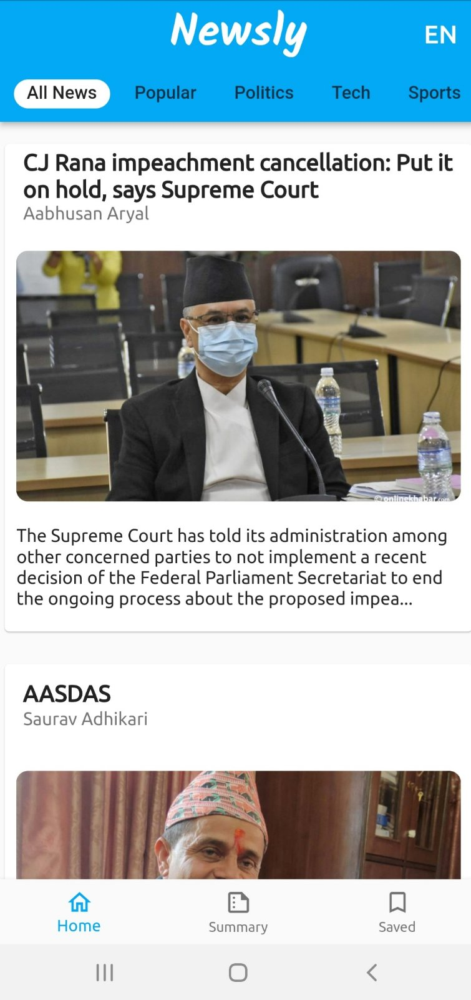

# Newsly
Newsly is a news app that tailors to your preferences! You can stay up to date on the latest news every day with Newsly. 

 

## Features

* Get a daily personalised summary of the news stories of your interest along with the top news of the day in both text and audio format that can be accessed even in offline mode.
* Get news feeds based on one’s interest. Eg: Technology, Politics, Sports, Entertainment, Health,Business, etc.
* Listen to the full news in both English and Nepali language.
* Be informed about what matters most to you via a daily email newsletter.
* Read the news offline when your device is not connected to internet.

 

### Home Page

 

### View news according to your language prefered: EN(English) or NP(Nepali)

 

### Viewing Summary

 

### View news according to your interest : Technology, Politics, Sports, Entertainment, Health,Business, etc.

 

## Setup Project

* Clone the project

 * Install flutter from [here](https://flutter.dev/docs/get-started/install)

* Run `flutter pub get` to install dependencies
* Run `flutter run` to run the project

