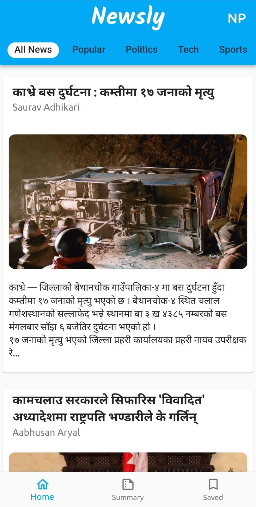

# Newsly

Newsly is a news app that tailors to your preferences! You can stay up to date on the latest news every day with Newsly.

 

## Features

- Get a daily personalised summary of the news stories of your interest along with the top news of the day in both text and audio format that can be accessed even in offline mode.
- Get news feeds based on one’s interest. Eg: Technology, Politics, Sports, Entertainment, Health,Business, etc.
- Listen to the full news in both English and Nepali language.
- Be informed about what matters most to you via a daily email newsletter.
- Read the news offline when your device is not connected to internet.

 

### Home Page

 

### News Detailed View

 

### View news according to your language prefered: EN(English) or NP(Nepali)

 

### Viewing Summary

 
 

## Code for backend:
https://github.com/ErSauravAdhikari/Newsly

 
  
## Installing the built file

- Download the built apk on your Android phone from [here](https://github.com/Nadika18/Newsly_frontend/releases).

- Open the downloaded .apk file and click on Install.

- Ignore any security warnings.

- Once installed, you can will see an icon for Newsly in your app drawer.

 

## Building the project

- Clone the project

- Install flutter from [here](https://flutter.dev/docs/get-started/install).

- Either [set up an emulator](https://docs.flutter.dev/get-started/install/windows#set-up-the-android-emulator) or [set up your android phone (enable USB debugging)](https://docs.flutter.dev/get-started/install/windows#set-up-the-android-emulator) to run the app.

- If you'd also like to run the backend locally (not recommended, because you'd need to populate the news on your own), check out [this repo](https://github.com/ErSauravAdhikari/Newsly).

- If you do set up your own repo, don't forget to change 'newsly.asaurav.com.np' to 'localhost:8000' in the file `/lib/models/1.dart`.

- Run `flutter pub get` to install dependencies

- Run `flutter run` to run the project
